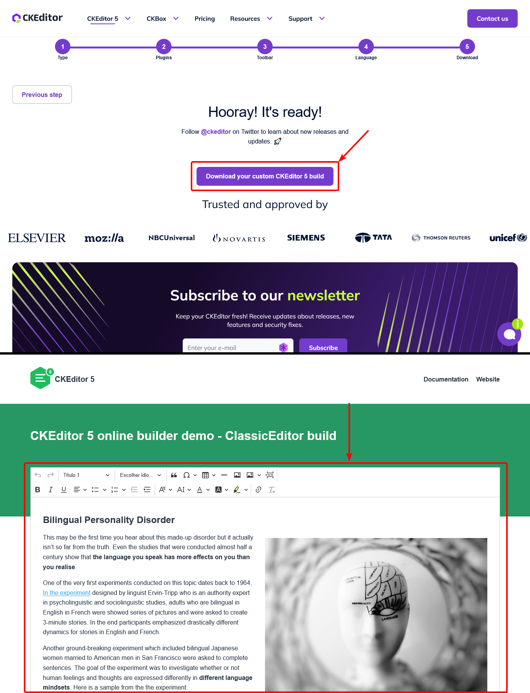

# Build do CKEditor

Para o **Build do CKEdtior**, foi necessário acessar o [site do ckeditor](https://ckeditor.com/ckeditor-5/), e criar um Build Customizado, utilizando a ferramenta do próprio site, o [Online Builder](https://ckeditor.com/ckeditor-5/online-builder/)

## Criando o Build Online

No **Online Builder**, selecionei a opção **_Classic_**, e depois fui selecionando cada um dos componentes que seriam utilizados, conforme abaixo:

> Ao selecionar os componentes, preste atenção nos que possuem uma "★", pois estes são componentes "**Premium**".

Depois organizei a interface, semelhante ao que seria a interface final, na própria ferramenta:

Então foi só selecionar o Idioma:

Mandar Buildar:

E Baixar o arquivo ZIP, contendo o editor Pronto:

